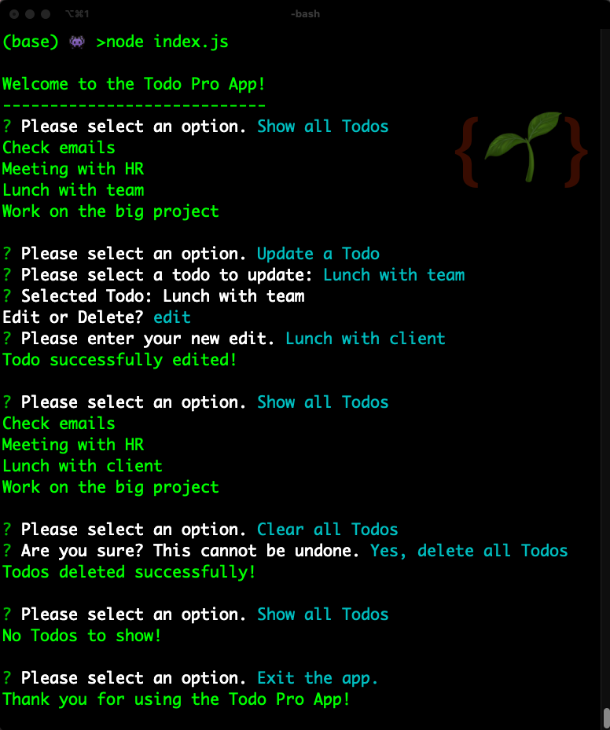

# Node Todo App

 

## Description

A Node.js command-line application for keeping track of your Todos in a simple and user-friendly way.

This project allowed me to improve my understanding of Node.js and gain experience using the Inquirer package for handling user input. It also allowed me to sharpen my JavaScript skills, particularly in utilising array methods such as `map()`, `filter()`, and `forEach()` effectively (to help target specific Todos), and developing a better understanding of the promise chaining method for handling asynchronous operations (to help cycle back to the main menu).

## Table of contents

- [Getting Started](#getting-started)
- [Features](#features)
- [Limitations](#limitations)
- [Future Enhancements](#future-enhancements)
- [Contribution](#contribution)
- [Credits](#credits)

## Getting Started

1. Download or clone the repository
2. Navigate to the repository folder in your terminal
3. Run `npm i` to install dependencies
4. Run `node index.js` to start the app

## Features

The app has the ability to add, edit or delete individual Todos, as well as the ability to show or clear all Todos. The user experience is also pretty neat in that actions always cycle back to a main menu from where the user can choose to exit the app.

## Limitations

There isn't any validation done on user input, which could lead to errors and unexpected behaviour. The display could benefit from improved formatting and styling.

## Future Enhancements

Here are some potential enhancements that could be implemented in future:

- Implementing input validation to ensure accurate data entry.
- Improving the user interface with better formatting and design elements to improve the overal user experience.
- Adding ability to assign a specific date and time to each Todo, for better organisation and planning.
- Implementing a feature to store completed Todos for record-keeping and future reference, as opposed to deleting them completely.

## Contribution

I welcome any and all contributions to the project. If you're interested in helping out, here are a few ways you can get involved:

1. Fork the repository and create a pull request with your changes.
2. Submit an issue to report bugs or request new features.
3. Help improve the documentation.

Please follow the guidelines for contributions:

- Make sure your code is well-documented and follows the same style as the rest of the codebase.
- Keep pull requests small and focused on a single change.
<!-- * Include test cases for any new features or changes. -->

If you have any questions or suggestions, feel free to contact me via [email](mailto:sb1664@gmail.com).

## Credits

- <a href="https://nodejs.org/en/" target="_blank">Node.js</a>
- <a href="https://www.npmjs.com/package/inquirer" target="_blank">Inquirer</a>
- <a href="https://developer.mozilla.org/en-US/docs/Web/JavaScript/Guide/Using_promises" target="_blank">Using promises [Mozilla]</a>
- <a href="https://www.youtube.com/watch?v=yr2pCF9nzWU" target="_blank">How to Break Out of a Promise Chain with JavaScript by Procure Eminence [YouTube]</a>
- <a href="https://github.com/jdtdesigns" target="_blank">JD Tadlock</a> (for building 95% of this app <a href="https://github.com/jdtdesigns/node_todo_app" target="_blank">here</a>)

  <a href="#top">Back to top</a>

